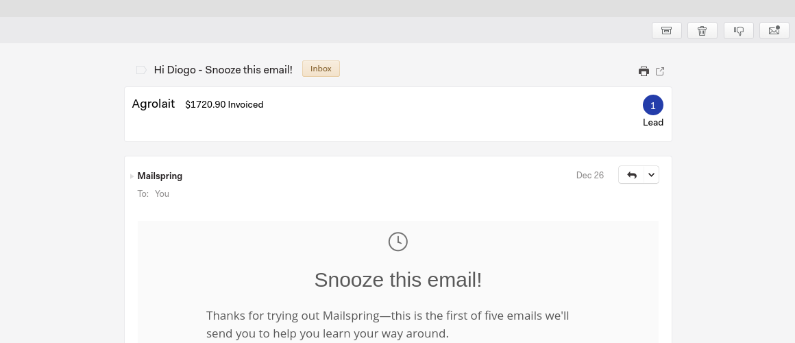
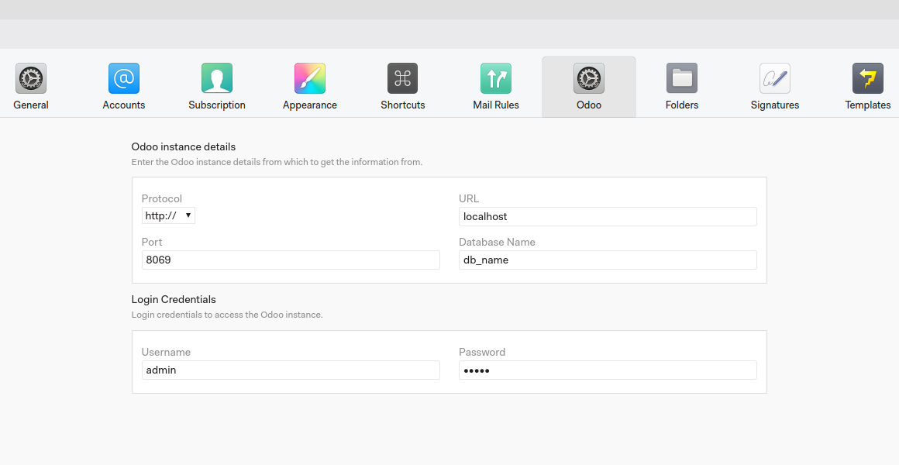

Mailspring Odoo integration
================

Mailspring Odoo plug-in will help you save time and quickly access information about your customers. With this feature you don’t need to open Odoo to look for information about who you’re exchanging emails with: on Mailspring, just click on the email and on top you can see the client’s total sales and the number of new leads.
The Mailspring Odoo plug-in will increase productivity by simplifying processes enabling fast decision making.
To work with Mailspring Odoo plug-in you’ll need both Mailspring and Odoo.

Simple configuration
--------------------------

To use the Odoo plug-in just enter the Odoo details in the preferences window and start using it right away.

See it in action
------------------

Mailspring is a free email app for Windows, Mac and Linux OS that adds new features to the regular email inbox. With Mailspring, you can manage multiple accounts in one unified inbox that provides activity and link tracking. Click [here](https://getmailspring.com/) for more information about the service.
